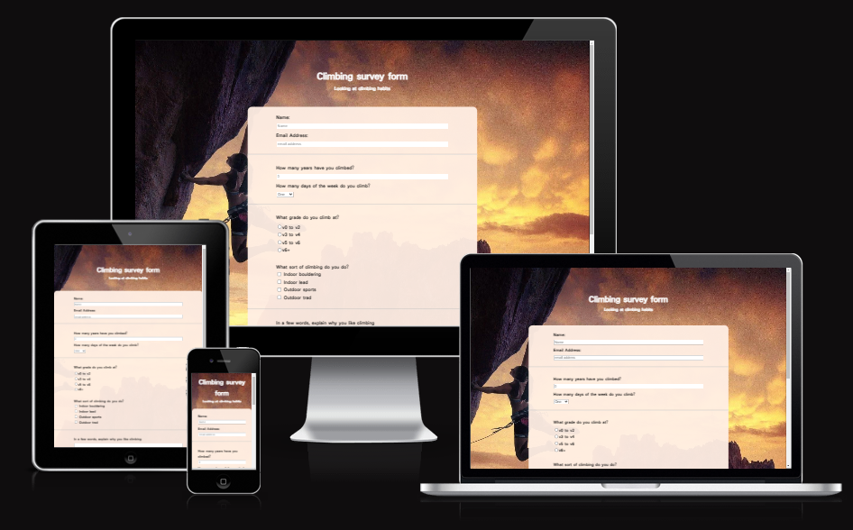
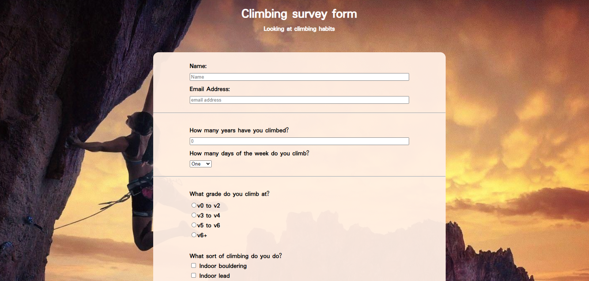

This project was bootstrapped with [Create React App](https://github.com/facebook/create-react-app).

# Online survey form

This project was completed as part of the [FreeCodeCamp](https://www.freecodecamp.org/) learn Responsive Web Design course.

## Site overview

The online survey form is a single page form that utilises the majority of the HTML form attributes.

## Project requirements
FreeCodeCamp has the following User Stories to complete:

- You should have a page title in an h1 element with an id of title
- You should have a short explanation in a p element with an id of description
- You should have a form element with an id of survey-form
- Inside the form element, you are required to enter your name in an input field that has an id of name and a type of text
- Inside the form element, you are required to enter your email in an input field that has an id of email
- If you enter an email that is not formatted correctly, you will see an HTML5 validation error
- Inside the form, you can enter a number in an input field that has an id of number
- If you enter non-numbers in the number input, you will see an HTML5 validation error
- If you enter numbers outside the range of the number input, which are defined by the min and max attributes, you will see an HTML5 validation error
- For the name, email, and number input fields, you can see corresponding label elements in the form, that describe the purpose of each field with the following ids: id="name-label", id="email-label", and id="number-label"
- For the name, email, and number input fields, you can see placeholder text that gives a description or instructions for each field
- Inside the form element, you should have a select dropdown element with an id of dropdown and at least two options to choose from
- Inside the form element, you can select an option from a group of at least two radio buttons that are grouped using the name attribute
- Inside the form element, you can select several fields from a series of checkboxes, each of which must have a value attribute
- Inside the form element, you are presented with a textarea for additional comments
- Inside the form element, you are presented with a button with id of submit to submit all the inputs

## Site design

### Basic setup

The site is a single page with a title and a form.

Due to the simplistic structure, everything is contained in a single react component, titled Form.

## Performance metrics 

![Lighthouse]

## Website launch

![Github]

# Credits

